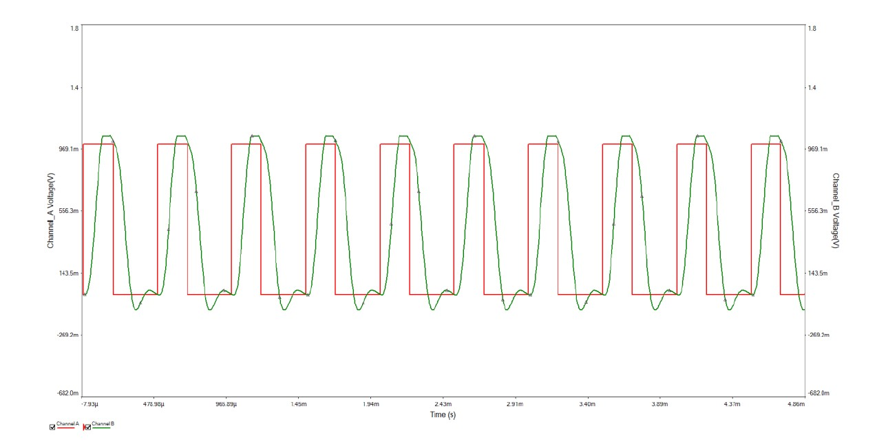

# Construction of Active and Passive circuits

This repository contains the implementation of four filters in Multisim:

- Butterworth Low-Pass
- Chebyshev High-Pass
- Inverse Chebyshev Band-Pass
- Chebyshev Band-Elimination

Moreover in each folder you can find the MATLAB scripts for the calculation of the parameters of the electronic components.

## Butterworth Low-Pass

After the parameters calculation the following transfer function results:

    

This function is graphically illustrated in MATLAB

     

Calculating the values of the electronic components, the following circuit is designed:

    

To investigate the proper function of this circuit, a pulse was given as input:

    

Subsequently an oscillator was used in the input and the output of the circuit:

    

 The transient analysis using this oscillator resulted in the following graph (red: input, green: output):

    

Finally, a Fourier analysis was performed for the input and the output signal:

    

    

From this graphs we can conclude that the circuit is working properly. The high frequencies are not allowed to pass through the filter.

---

## Chebyshev High-Pass

After the parameters calculation the following transfer function results:

    

This function is graphically illustrated in MATLAB

     

Calculating the values of the electronic components, the following circuit is designed:

    

To investigate the proper function of this circuit, a sum of sine signals was given as input and an oscillator was used:

    

 The transient analysis using this oscillator resulted in the following graph for input:

    

and the following graph for the output signal:

    

Finally, a Fourier analysis was performed for the input and the output signal:

    

    

From this graphs we can conclude that the circuit is working properly. The low frequencies are not allowed to pass through the filter.

---

## Inverse Chebyshev Band-Pass

After the parameters calculation the following transfer function results:

    

This function is graphically illustrated in MATLAB

     

Calculating the values of the electronic components, the following circuit is designed:

    

To investigate the proper function of this circuit, a sum of sine signals was given as input and an oscillator was used:

    

 The transient analysis using this oscillator resulted in the following graph for input (red) and output (green):

    

Finally, a Fourier analysis was performed for the input and the output:

    

    

From this graphs we can conclude that the circuit is working properly. The low and the high frequencies are not allowed to pass through the filter.

---

## Chebyshev Band-Elimination

After the parameters calculation the following transfer function results:

    

This function is graphically illustrated in MATLAB

     

Calculating the values of the electronic components, the following circuit is designed:

    

To investigate the proper function of this circuit, a sum of sine signals was given as input and an oscillator was used:

    

 The transient analysis using this oscillator resulted in the following graph for input and output:

    

    

Finally, a Fourier analysis was performed for the input and the output:

    

    

From this graphs we can conclude that the circuit is working properly. The in-between frequencies (in this case 2.287 𝑘𝐻𝑧) are not allowed to pass through the filter.

---

